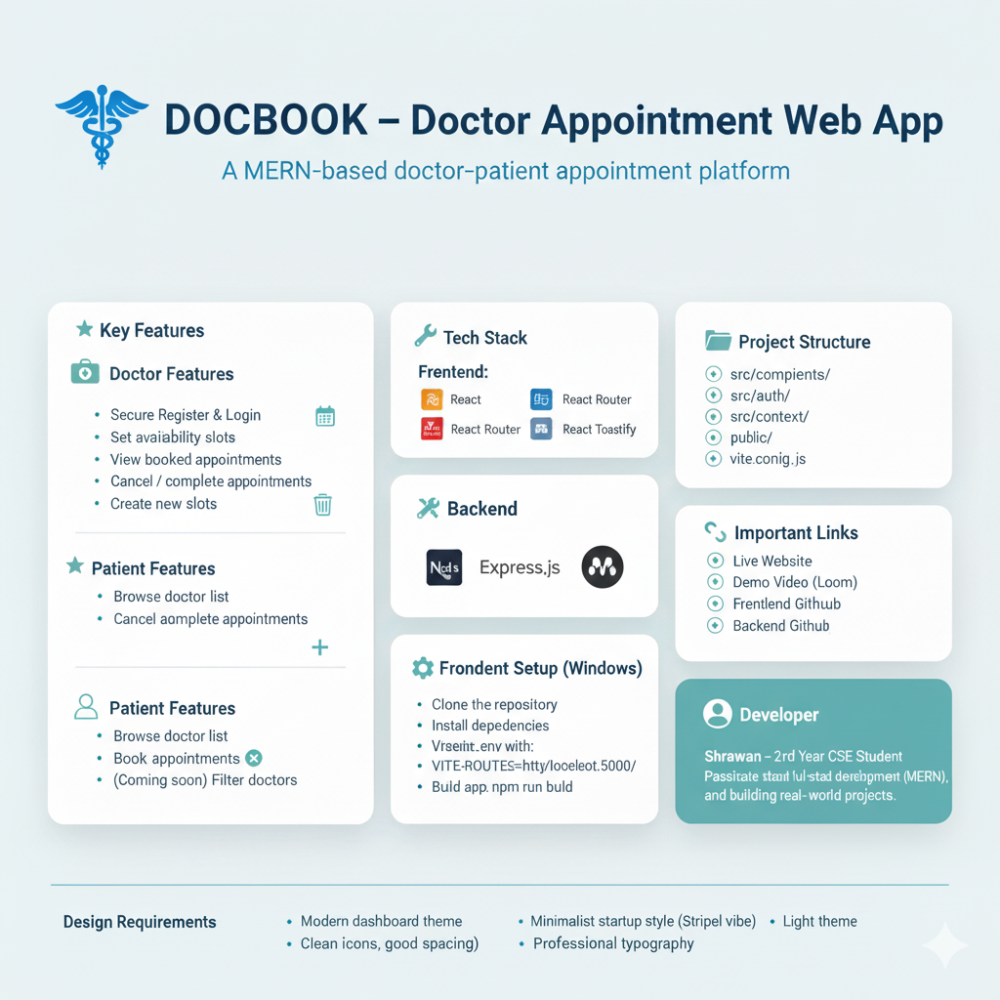

# 🩺 DOCBOOK – Doctor Appointment Web App



**DOCBOOK** is a simple and easy-to-use web application built with the **MERN Stack** (MongoDB, Express.js, React, Node.js). It allows doctors to manage their availability and patients to book appointments online.

🎥 **Demo Video**: [Watch on Loom](https://www.loom.com/share/82ed6c376f084c19a38d0e09e71bc2aa?sid=99b8090a-cf23-480d-84a0-1cfa4ec968a4)

🌐 **Live Website**: [docbook-frontend-taupe.vercel.app](https://docbook-frontend-taupe.vercel.app/)

📦 **GitHub Repositories**:
- [Frontend Code](https://github.com/Dharamraj82/DOCBOOK_Frontend)
- [Backend Code](https://github.com/Dharamraj82/DOCBOOK_Backend)

---

## ✨ Key Features

### 👨‍⚕️ Doctor Functionality:
- Register and login securely
- Set availability slots for appointments
- View all booked appointments
- Cancel or mark appointments as completed 
- Create new slots

### 👨‍💻 Patient Functionality:
- Register and login securely
- Browse list of available doctors
- Book appointments based on available slots
- Cancel booked appointments 
- Filter doctors by type or available dates (coming soon)

---

## 🛠️ Tech Stack

### Frontend:
- **React.js** – UI development
- **Tailwind CSS** – Styling
- **React Router** – Page navigation
- **Axios** – API communication
- **React Toastify** – Notifications

### Backend:
- **Node.js + Express.js** – API and server
# DOCBOOK — Doctor Appointment Booking (Frontend)

**Developer:** Shrawan

This repository contains the frontend for the DOCBOOK doctor-patient appointment booking application. It's built with React + Vite and styled with Tailwind CSS. The frontend communicates with a separate backend API (not included here) using a base URL provided through Vite environment variables.

**This README focuses on local setup for development on Windows (PowerShell).**

**Prerequisites:**
- **Node.js:** v18 or newer (LTS recommended)
- **npm** (comes with Node) or **yarn**
- A running backend API (optional for full functionality)

**Repository**
- Path: `.` (this repository is the frontend app)

**Important env key**
- `VITE_ROUTES` : Base URL used by the app to reach backend endpoints (example: `http://localhost:5000/`).

**Quick Start (Windows PowerShell)**

1. Clone the repo and install dependencies

```powershell
git clone https://github.com/shrawanyadkr2/Doctor-Appointment-Booking-Frontend.git
cd Doctor-Appointment-Booking-Frontend
npm install
```

2. Create a local environment file

Create a file named `.env` in the project root and add the backend base URL. Be sure to include a trailing slash where the code expects it (the code constructs endpoints like `${import.meta.env.VITE_ROUTES}auth/...`). Example:

```text
VITE_ROUTES=http://localhost:5000/
```

3. Run the dev server

```powershell
npm run dev
```

Open the URL printed by Vite (usually `http://localhost:5173`) in your browser.

4. Build for production

```powershell
npm run build
```

5. Preview the production build locally

```powershell
npm run preview
```

6. Linting

```powershell
npm run lint
```

Project scripts (from `package.json`)
- `dev`: Run Vite dev server (`npm run dev`)
- `build`: Build production assets (`npm run build`)
- `preview`: Locally preview the production build (`npm run preview`)
- `lint`: Run ESLint (`npm run lint`)

Project structure (important files/folders)
- `src/` : Application source
	- `App.jsx`, `main.jsx` : App entry
	- `index.css` : Tailwind + app styles
	- `componets/` : Reusable UI components and doctor/patient components
	- `auth/` : Authentication pages (Login/Register/Forget)
	- `context/` : React context providers (Auth, Theme)
	- `pages/` : Route-level pages (Home, Doctors, Dashboard, Booking)
- `public/` : Static assets
- `vite.config.js` : Vite configuration
- `tailwind.config.js` : Tailwind configuration

Notes about environment variables
- The code uses `import.meta.env.VITE_ROUTES` as the base API route. Make sure the backend URL you provide is reachable from your machine. Example values:
	- Local backend: `http://localhost:5000/`
	- Staging: `https://staging-api.example.com/`

Troubleshooting
- If API calls fail, confirm `VITE_ROUTES` is set and the backend is running.
- If you see CORS errors, ensure the backend allows requests from the frontend origin.
- If you upgraded Node and the project fails to start, delete `node_modules` and `package-lock.json` and reinstall:

```powershell
rm -Recurse -Force node_modules; rm package-lock.json
npm install
```

Contributing
- Create a feature branch, make your changes, and open a PR. Keep changes focused and include a short description.

License
- This repository does not include a license file. Add one if you plan to make the project public.

Contact
- Developer: **Shrawan**

---

If you want, I can also:
- add a sample `.env.example` file to the repository
- update `package.json` with a helpful `start` script
- add a short development checklist
